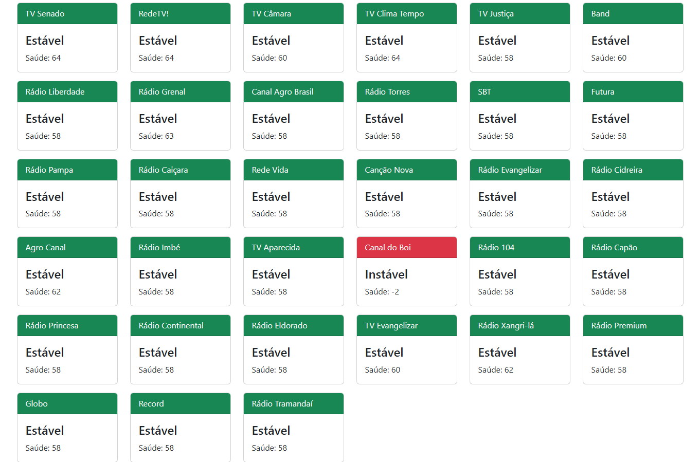

# :rocket: CDNTV Monitor

```
Versão 0.0.1-Beta

[Não é um monitoramento oficial, desenvolvido apenas por diversão] 
```

---
### Monitoramento de Canais CDNTV
---

## :wrench: Instalação
* Envie os arquivos do diretório `www` para o seu servidor Web.
* Abra o arquivo `config/config.php` com editor de textos:
  * Na constante `CDNTV_URL`, informe a URL da API de seu servidor CDNTV
* Execute o Composer no arquivo `composer.json`.

---

---

## :heavy_check_mark: Modo de Usar
* Serão listados todos os canais habilitados
* Os canais estáveis ficarão de verde, e os instáveis de vermelho.

## :golf: Changelog:
* `Versão 0.0.1-Beta - 07/11/2022`
---

## :sparkling_heart: Nos Ajude a Crescer
>Se este Material foi útil para você, ajude se inscrevendo no meu canal do YouTube.
>
>(https://youtube.com/techlabs94?sub_confirmation=1)
>
>Isso me incentiva a trazer mais materiais como este e muitos outros de redes e tecnologia.
>
>## 


## :iphone: Contato e Informações
[](https://api.whatsapp.com/send?phone=5537999351046)